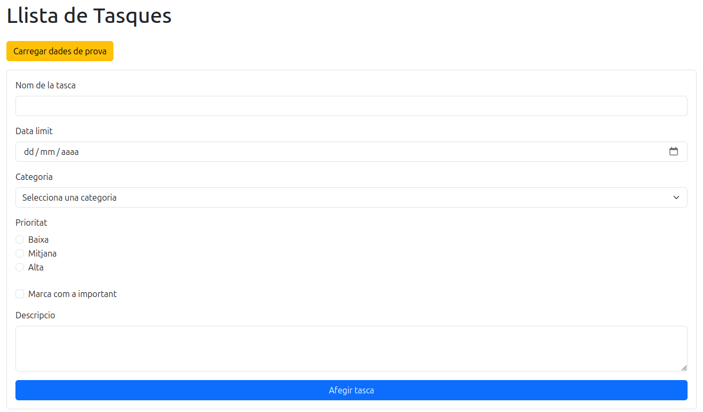
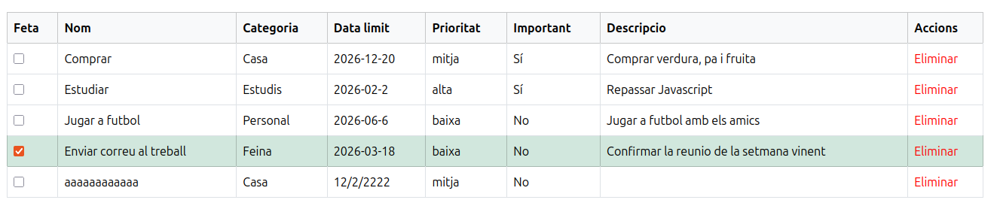

# Gestor de Tasques

## 1. Descripció de l'aplicació

Aquesta aplicació permet gestionar tasques de manera senzilla i visual. La aplicació fa:

- Afegir noves tasques
- Marcar tasques com a fetes
- Eliminar tasques
- Carregar dades de prova
- Veure un llistat de totes les tasques amb la seva informació

---

## 2. Captura del resultat final

---

## 3. Explicació breu de com executar el projecte

**1. Entrar a la carpeta del projecte:**

cd ProjecteT2

**2. Instal·lar les dependències:**

npm install

**3. Arrencar el projecte:**

npm run dev

**4. Entar a la url:**

http://localhost:5173

---

## 4. Funcionalitats implementades

- Formulari amb els camps:
- Nom de la tasca
- Categoria
- Data límit
- Prioritat
- Important (checkbox)
- Descripció

- Validació de formulari amb React Hook Form + Zod
- Llistat de tasques amb tota la informació
- Marcar tasques com a fetes/desfer
- Eliminar tasques amb un link vermell
- Carregar dades de prova seedTasks.json amb un botó
- Components reutilitzables (Input, Select, Checkbox...)

---

## 5. Recursos utilitzats

- [React](https://reactjs.org/) – Framework principal
- [Vite](https://vitejs.dev/) – Eina de bundling i desenvolupament ràpid
- [Bootstrap](https://getbootstrap.com/) – Estil visual
- [React Hook Form](https://react-hook-form.com/) – Gestió de formularis
- [Zod](https://zod.dev/) – Validació de formularis
- JSON per a dades de prova (seedTasks.json)

---

## 6. Passos seguits per la implementació

1. Creació del projecte amb Vite + React + JavaScript  
2. Instal·lació de Bootstrap, React Hook Form i Zod  
3. Creació dels components del formulari
4. Creació del component principal TaskForm.jsx amb validació  
5. Creació del llistat de tasques TaskList.jsx  
6. Separació de cada fila de tasca a TaskItem.jsx  
7. Implementació de funcionalitat marcar/desmarcar tasques com a fetes i eliminar tasques
8. Creació del fitxer seedTasks.json i botó per carregar dades de prova  
9. Pagina amb estils de Bootstrap

---